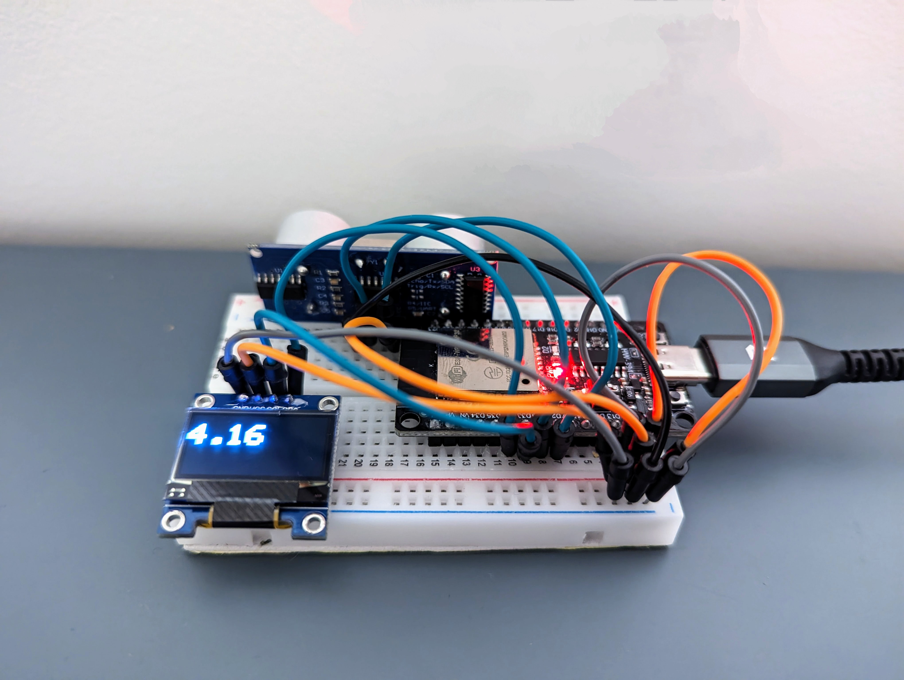
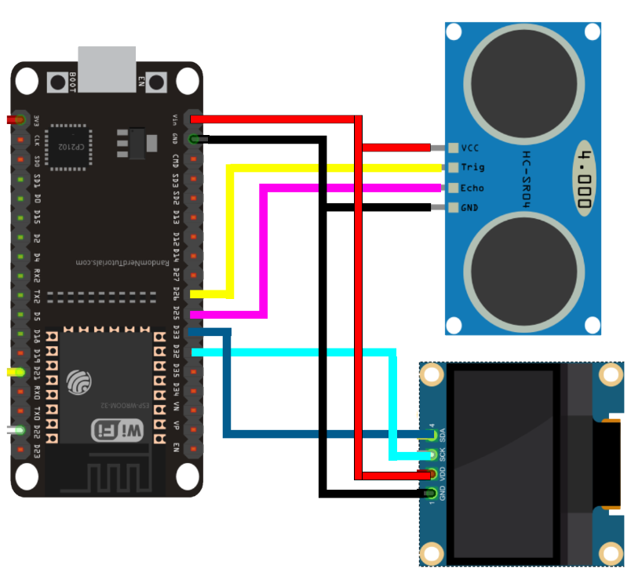

# Measurer 9000 - IoT Distance Measuring Project

## Purpose

The Measurer 9000 is an IoT project that utilizes an ultrasonic sensor to measure the distance between the device and any object. It then displays this distance both on an OLED screen and a webpage for convenient monitoring.

## Parts List

- 1 x ESP32
- 1 x HC-SR04 Ultrasonic Sensor
- 1 x SSD1306 OLED Display
- 1 x Breadboard
- Jumper Wires

## Wiring

### Ultrasonic Sensor

- GND - GND
- VCC - VN
- TRIG - GPIO 26
- ECHO - GPIO 25

### OLED Screen

- GND - GND
- VCC - VN
- SCL - GPIO 32
- SDA - GPIO 33

## Diagram

## Setup

### Arduino Setup

1. Install the following libraries in your Arduino IDE:
   - Adafruit GFX
   - Adafruit SSD1306
   - aREST

2. Replace "network-id" and "network-password" with your Wi-Fi network's SSID and password in the code.

3. Flash the code to your ESP32.

### Web Server Setup

1. Verify that you have Node.js and npm installed on your computer by running the following commands in your terminal:
   - `node --version`
   - `npm --version`

2. Initialize a Node.js project:
   - Run `npm init -y`

3. Install required dependencies:
   - `npm install express`
   - `npm install undici`

4. Start the server:
   - Run `node server.js`

5. You should now be able to view your distance measurements from the server as long as you are connected to the same network.
